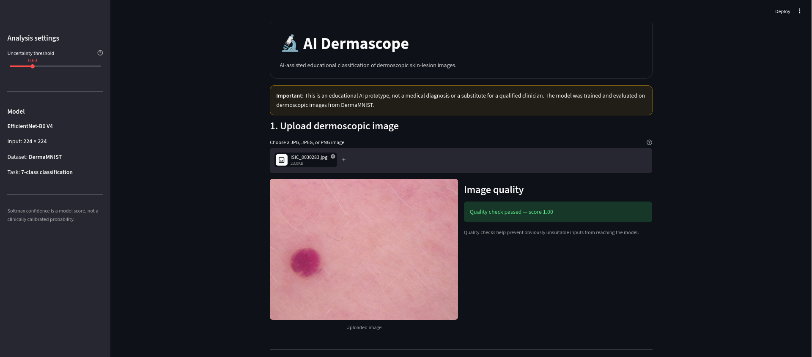
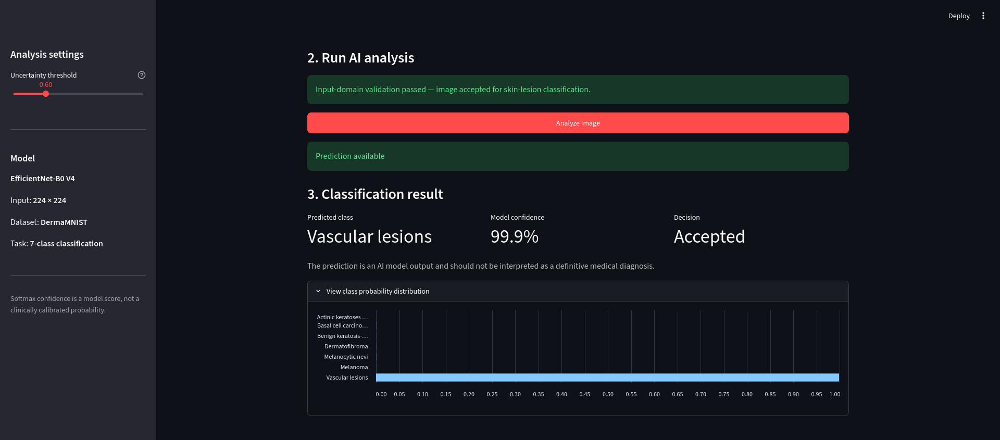
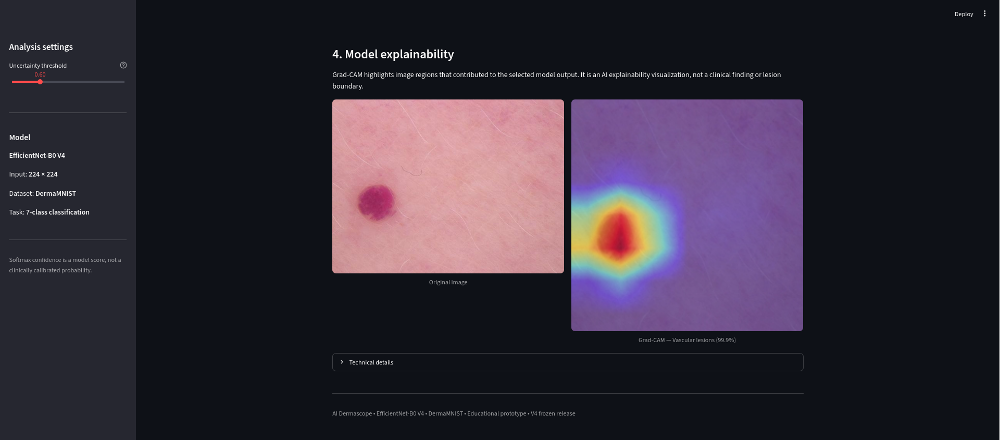
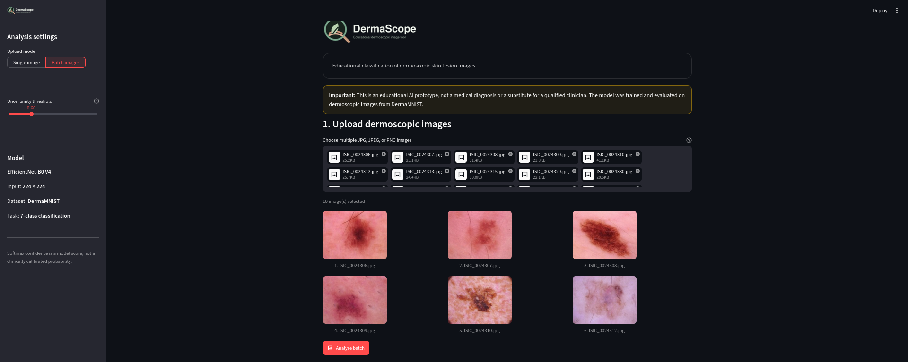
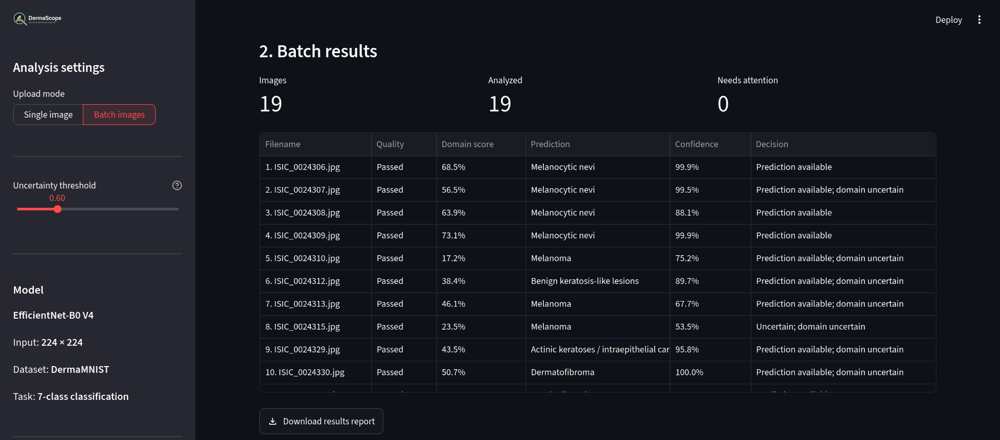
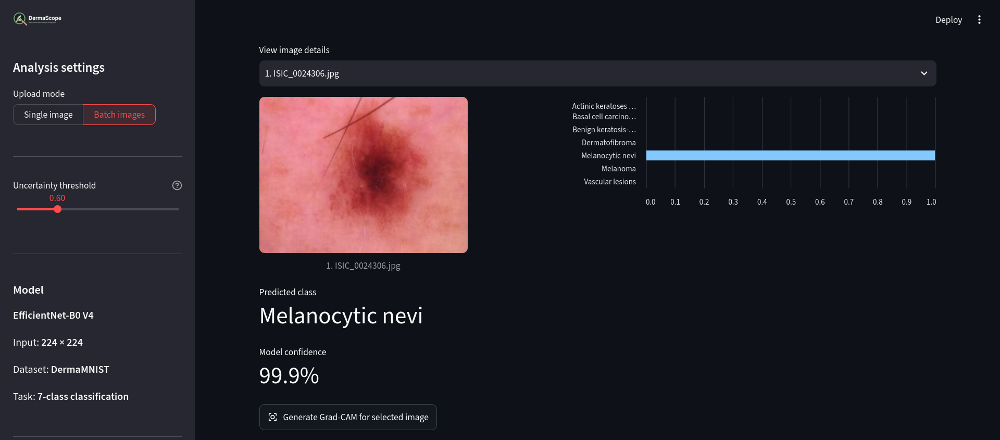
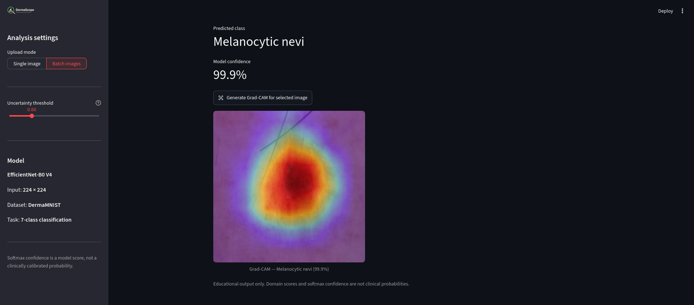

# DermaScope


DermaScope is an educational Streamlit application for classifying dermoscopic skin-lesion images. It uses an EfficientNet-B0 V4 model trained on DermaMNIST to predict one of seven classes. It is a research and learning prototype, not a medical diagnostic system.

## Features

- Choose single-image or batch-image analysis from the sidebar.
- Check image quality before classification and report individual failures in batch results.
- Show dermoscopic-domain scores as advisory signals; an uncertain score does not block analysis.
- Review predictions, model confidence, class probabilities, and Grad-CAM visualizations.
- Download a CSV report for a completed analysis. Single-image reports include class probabilities. Batch reports include every uploaded file, its outcome, the confidence threshold, and per-class probabilities for successfully analyzed images.

## Screenshots

### Image upload and quality check



### Classification result



### Grad-CAM explanation



### Batch image upload



### Batch results



### Per-image batch details



### Batch Grad-CAM explanation



## Model

| Setting | Value |
| --- | --- |
| Architecture | EfficientNet-B0 V4 |
| Dataset | DermaMNIST |
| Input size | 224 × 224 |
| Output classes | 7 |
| Runtime device | CUDA when available; otherwise CPU |
| Checkpoint | `models/v4_efficientnet_b0_dermamnist_224.pt` |

The classes are actinic keratoses / intraepithelial carcinoma, basal cell carcinoma, benign keratosis-like lesions, dermatofibroma, melanoma, melanocytic nevi, and vascular lesions.

The app's softmax confidence is not a clinically calibrated probability. Grad-CAM is an explanation visualization, not a lesion boundary or clinical finding.

## Run locally

Use a Python version supported by the pinned packages in `requirements.txt`.

```bash
python3 -m venv .venv
source .venv/bin/activate
python -m pip install --upgrade pip
python -m pip install -r requirements.txt
streamlit run app.py
```

Open the local URL printed by Streamlit. In the sidebar, choose **Single image** or **Batch images**. The single-image workflow displays quality and domain checks before the **Analyze Image** action. In batch mode, upload multiple JPG, JPEG, or PNG files and select **Analyze batch**. Download the CSV from the results section when analysis is complete.

## Deploy to Streamlit Community Cloud

The repository is prepared for a public Streamlit Community Cloud deployment. Use the repository's `app.py` entrypoint and `requirements-cloud.txt` as the dependency file in the Streamlit Cloud dashboard. Select Python 3.12, because the pinned PyTorch and torchvision versions are designed for that supported runtime.

Before publishing, confirm that the two model checkpoints in `models/` are included in the repository and that the cloud app uses the same configuration as this workspace. The application limits single uploads to 20 MB and batch uploads to 20 images. The Cloud dashboard should be configured with the repository's `.streamlit/config.toml` and a public HTTPS URL is generated automatically.

For the final public smoke test, upload one valid dermoscopic image, verify the classification and Grad-CAM output, switch to batch mode, upload two images, and confirm that the CSV report downloads successfully.

## Tests

Run the automated test suite and syntax check from the project root:

```bash
python -m pytest -q
python -m py_compile app.py src/*.py
```

Tests cover image quality, inference outputs, domain checks, Grad-CAM, report serialization, and Streamlit single/batch upload flows, including duplicate filenames and unreadable batch files.

## Project layout

- `app.py` — Streamlit interface and single/batch analysis workflows.
- `src/` — inference, domain checks, image-quality checks, Grad-CAM, and report serialization.
- `models/` — model checkpoints used by the app.
- `assets/` — logo and application screenshots.
- `tests/` — unit and Streamlit AppTest coverage.
- `results/` — training and evaluation artifacts.

## Limitations

The model was trained and evaluated on dermoscopic DermaMNIST images. Results may be unreliable for other image types or populations and must not be used to make medical decisions. Consult a qualified clinician for diagnosis or treatment.
